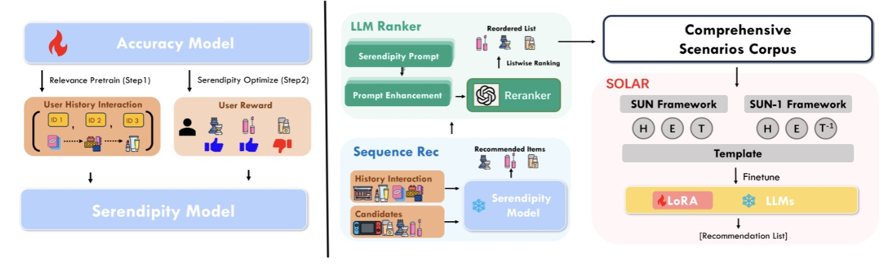

# SOLAR

This is the official Pytorch Implementation for the paper:

> *"SOLAR: Serendipity Optimized Language Model Aligned for Recommendation"*

## Overview

We propose SOLAR, a serendipity-optimized language model aligned for recommendation. SOLAR involves three steps from a small set of available labels: First, we train a ID-based model that balances accuracy and serendipity; Second, we leverage LLM-based reranking to generate high-quality fine-tuning data at a large scale; Finally, we construct recommendation-oriented instruction sets to finetune the LLM for aligning with real human preferences.

By using the above framework, SOLAR addressed the domain gap and label scarcity issue, and outperforms basedlines in both accuracy and serendipity.



## Dataset

The processed datasets are released at this [link](https://drive.google.com/drive/folders/1btYAQScp94u9Vxa-jQiFc-7WlGGUHgcs?usp=sharing).

## Requirements

To install llamafactory, refer to [official repository](https://github.com/hiyouga/LLaMA-Factory).

```plaintext
torch==2.5.1
pandas==2.2.3
numpy==1.26.4
llamafactory==0.9.2
Levenshtein==0.26.1
tqdm==4.67.1
openai==1.61.1

```

## Data Generation

### Generating SASRec Inference Results

Run the following command to generate SASRec inference results:
```python
python datagen/export_id_model_result.py --data=<dataset_path> --ckpt=<ckpt_path>
```

### Generating Rerank Results

To produce rerank results, execute:

```python
python llm_rerank.py --topic <topic> --num_samples 100 --num_icls 4 --res_path <res_path> --title_path <title_path> --output_file <output_file>
```

For detailed instructions on creating the instruction dataset, please refer to the contents of the datagen/instgen folder.

## Train

### Training the Serendipity-Finetuned Model

1. Initial Training: Train the SASRec model on a relevance-labeled dataset.

2. Fine-tuning: Further fine-tune the model using the serendipity-labeled dataset.

These steps can be performed using the following script with the appropriate arguments:

```python
python datagen/train_id_model.py --[your_args_here]
```

### Training SOLAR

- Prerequisite: Ensure that llamafactory is installed.

- LoRA Training: Train SOLAR using LoRA by providing the configuration file located in the `configs/` directory.

## Test

To evaluate the SOLAR model:

1. Deploy: Deploy SOLAR using llamafactory with the VLLM API exported.

2. Run the Test Script: Execute the test script with the necessary arguments. For example:

```python
python test.py --data="dataset/movielens" --model_name="models/llama3_lora_sft_solarlm_ml/" --vllm_port=12345 --testset="testset/movielens"
```

## Acknowledgement

The training code of SASRec is adopted from [SASRec.pytorch](https://github.com/pmixer/SASRec.pytorch).

[LLaMA-Factorcy](https://github.com/hiyouga/LLaMA-Factory) is used for large language model training.
